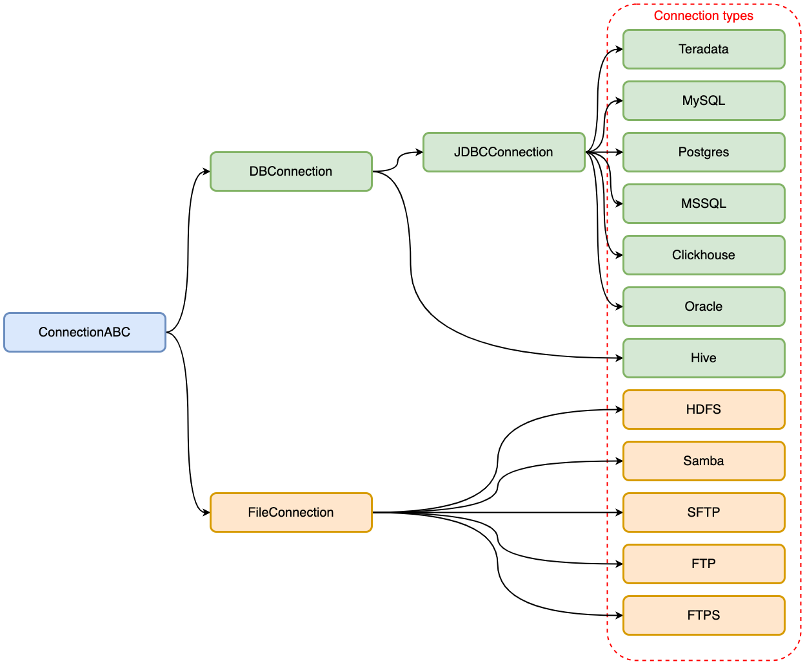

********
Concepts
********

Here you can find detailed documentation about each one of the onETL concepts and how to use them.

Connection
==========

onETL is used to pull and push data into other systems, and so it has a first-class ``Connection`` concept for storing credentials that are used to communicate with external systems.

A ``Connection`` is essentially a set of parameters - such as username, password, hostname.

To create a connection to a specific storage type, you must use a **unique class** that matches the storage type. The class name is the same as the storage type name (``Oracle``, ``MSSQL``, ``SFTP``, etc):

.. code:: python

    from onetl.connection import SFTP

    sftp = SFTP(
        host="sftp.test.com",
        user="onetl",
        password="onetl",
    )

All connection types are inherited from the parent class ``ConnectionABC``.

Class diagram:

DBConnection
------------

``DBConnection`` could be used for accessing databases.

A ``DBConnection`` could be instantiated as follows:

.. code:: python

    from onetl.connection import MSSQL

    mssql = MSSQL(
        host="mssqldb.demo.com",
        user="onetl",
        password="onetl",
        database="Telecom",
        spark=spark,
        extra={"ApplicationIntent": "ReadOnly"},
    )

where  **spark** is the current SparkSession. ``onETL`` uses ``Spark`` under the hood to work with databases.

For a description of other parameters, see the documentation for the `available DBConnections <db_connection/clickhouse.html>`_.

FileConnection
--------------

``FileConnection`` could be used to access files stored on the different file systems/file servers

A ``FileConnection`` could be instantiated as follows:

.. code:: python

    from onetl.connection import SFTP

    sftp = SFTP(
        host="sftp.test.com",
        user="onetl",
        password="onetl",
    )

For a description of other parameters, see the documentation for the `available FileConnections <file_connection/ftp.html>`_.

Check connection
----------------

Once you have created the required connection, you can check the storage availability using the method ``check()``:

.. code:: python

    sftp.check()

Extract/Load data
=================

As we said above, onETL is used to pull and push data into other systems. onETL provides several classes for this: ``DBReader``/``DBWriter``, ``FileDownloader``/``FileUploader``.

All of these classes have the only method ``run()``, that starts to extract/load data:

.. code:: python

    from onetl.core import DBReader, DBWriter

    reader = DBReader(
        connection=mssql,
        table="dbo.demo_table",
        columns=["column_1", "column_2"],
    )

    # Extract data to df
    df = reader.run()

    writer = DBWriter(
        connection=hive,
        table="dl_sb.demo_table",
    )

    # Load df to hive table
    writer.run(df)

Extract data
------------

To extract data you can use classes:

+------------------------------------------------+--------------------------------------------------------------------------------------------------------------------------------------------------------------------------------------+-------------------------+-----------------------------+------------------------------+
|                                                | Use case                                                                                                                                                                             | Connection              | ``run()`` gets              | ``run()`` returns            |
+================================================+======================================================================================================================================================================================+=========================+=============================+==============================+
| `DBReader <core/db_reader.html>`_              | Reading data from a database and saving it as a `Spark DataFrame <https://spark.apache.org/docs/latest/api/python/reference/api/pyspark.sql.DataFrame.html#pyspark.sql.DataFrame>`_  | Any ``DBConnection``    | \-                          | DataFrame                    |
+------------------------------------------------+--------------------------------------------------------------------------------------------------------------------------------------------------------------------------------------+-------------------------+-----------------------------+------------------------------+
| `FileDownloader <core/file_downloader.html>`_  | Download files to a local FS from a file storage                                                                                                                                     | Any ``FileConnection``  | \-                          | List[File path on local FS]  |
+------------------------------------------------+--------------------------------------------------------------------------------------------------------------------------------------------------------------------------------------+-------------------------+-----------------------------+------------------------------+

Load data
---------

To load data you can use classes:

+----------------------------------------------+-------------------------------------------------------------------------------------------------------------------------------------------------------------------------+--------------------------+-------------------------------+--------------------------------+
|                                              | Use case                                                                                                                                                                | Connection               | ``run()`` gets                | ``run()`` returns              |
+==============================================+=========================================================================================================================================================================+==========================+===============================+================================+
| `DBWriter <core/db_writer.html>`_            | Writing data from a `Spark DataFrame <https://spark.apache.org/docs/latest/api/python/reference/api/pyspark.sql.DataFrame.html#pyspark.sql.DataFrame>`_ to a database   | Any ``DBConnection``     | DataFrame                     | \-                             |
+----------------------------------------------+-------------------------------------------------------------------------------------------------------------------------------------------------------------------------+--------------------------+-------------------------------+--------------------------------+
| `FileUploader <core/file_downloader.html>`_  | Uploading files from a local FS to a file storage                                                                                                                       | Any ``FileConnection``   | List[File path on local FS]   | List[File path on storage FS]  |
+----------------------------------------------+-------------------------------------------------------------------------------------------------------------------------------------------------------------------------+--------------------------+-------------------------------+--------------------------------+

Options
-------

``DBReader``/``DBWriter`` classes have a ``options`` parameter :

.. code:: python

    reader = DBReader(
        connection=mssql,
        table="dbo.demo_table",
        options=MSSQL.Options(fetchsize=1000) # or options={"fetchsize": "1000"}
    )

The difference between the rest of the class parameters and the "options" parameter is that they can be logically divided according to what they describe:

* "options" parameter - HOW we extract/load data
* all other parameters - WHAT we extract / WHERE we load

.. code:: python

    reader = DBReader(
        # What do we extract?
        connection=mssql,
        table="dbo.demo_table",
        columns=["column_1", "column_2"],
        # How do we extract?
        options=MSSQL.Options(fetchsize=1000, sessionInitStatement="select 1")
    )

    writer = DBWriter(
        # Where do we load?
        connection=hive,
        table="dl_sb.demo_table",
        # How do we load?
        options=Hive.Options(mode="overwrite", insertInto=True),
    )

More information about Options could be found `here <core/db_reader.html>`_ (DBReader options) and `here <core/db_writer.html>`_ (DBWriter options)

Read Strategies
---------------

onETL have several builtin strategies for reading data:

1. `Snapshot strategy <strategy/snapshot_strategy.html>`_ (default strategy)
2. `Incremental strategy <strategy/incremental_strategy.html>`_
3. `Snapshot batch strategy <strategy/snapshot_batch_strategy.html>`_
4. `Incremental batch strategy <strategy/incremental_batch_strategy.html>`_

For example, an incremental strategy allows you to get only new data from the source each time you run DBReader:

.. code:: python

    from onetl.strategy import IncrementalStrategy

    reader = DBReader(
        connection=mssql,
        table="dbo.demo_table",
        hwm_column="id",
    )

    # first run
    with IncrementalStrategy():
        df = reader.run()

    sleep(3600)

    # second run
    with IncrementalStrategy():
        df = reader.run() # only data, that appeared in the source within the last hour will be received
