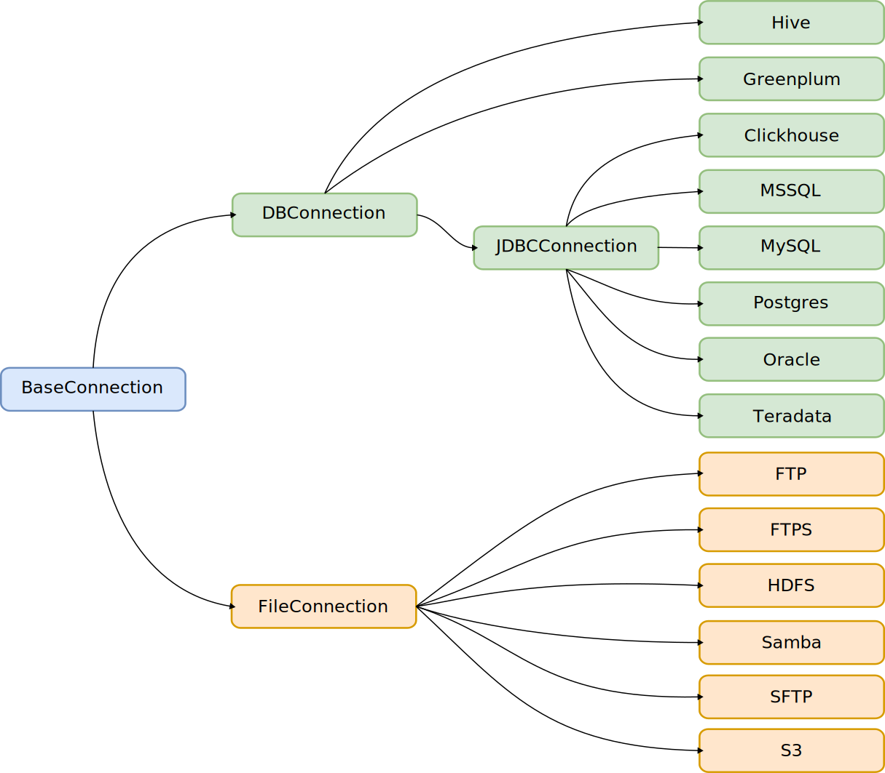

********
Concepts
********

Here you can find detailed documentation about each one of the onETL concepts and how to use them.

Connection
==========

Basics
------

onETL is used to pull and push data into other systems, and so it has a first-class ``Connection`` concept for storing credentials that are used to communicate with external systems.

A ``Connection`` is essentially a set of parameters, such as username, password, hostname.

To create a connection to a specific storage type, you must use a class that matches the storage type. The class name is the same as the storage type name (``Oracle``, ``MSSQL``, ``SFTP``, etc):

.. code:: python

    from onetl.connection import SFTP

    sftp = SFTP(
        host="sftp.test.com",
        user="onetl",
        password="onetl",
    )

All connection types are inherited from the parent class ``BaseConnection``.

Class diagram
-------------

DBConnection
------------

Classes inherited from ``DBConnection`` could be used for accessing databases.

A ``DBConnection`` could be instantiated as follows:

.. code:: python

    from onetl.connection import MSSQL

    mssql = MSSQL(
        host="mssqldb.demo.com",
        user="onetl",
        password="onetl",
        database="Telecom",
        spark=spark,
    )

where  **spark** is the current SparkSession.
``onETL`` uses ``Spark`` and specific Java connectors under the hood to work with databases.

For a description of other parameters, see the documentation for the :ref:`available DBConnections <db-connections>`.

FileConnection
--------------

Classes inherited from ``FileConnection`` could be used to access files stored on the different file systems/file servers

A ``FileConnection`` could be instantiated as follows:

.. code:: python

    from onetl.connection import SFTP

    sftp = SFTP(
        host="sftp.test.com",
        user="onetl",
        password="onetl",
    )

For a description of other parameters, see the documentation for the :ref:`available FileConnections <file-connections>`.

FileDFConnection
----------------

Classes inherited from ``FileDFConnection`` could be used for accessing files as Spark DataFrames.

A ``FileDFConnection`` could be instantiated as follows:

.. code:: python

    from onetl.connection import SparkHDFS

    spark_hdfs = SparkHDFS(
        host="namenode1.domain.com",
        cluster="mycluster",
        spark=spark,
    )

where  **spark** is the current SparkSession.
``onETL`` uses ``Spark`` and specific Java connectors under the hood to work with DataFrames.

For a description of other parameters, see the documentation for the :ref:`available FileDFConnections <file-df-connections>`.

Checking connection availability
--------------------------------

Once you have created a connection, you can check the database/filesystem availability using the method ``check()``:

.. code:: python

    mssql.check()
    sftp.check()
    spark_hdfs.check()

It will raise an exception if database/filesystem cannot be accessed.

This method returns connection itself, so you can create connection and immediately check its availability:

.. code:: Python

    mssql = MSSQL(
        host="mssqldb.demo.com",
        user="onetl",
        password="onetl",
        database="Telecom",
        spark=spark,
    ).check()  # <--

Extract/Load data
=================

Basics
------

As we said above, onETL is used to extract data from and load data into remote systems.

onETL provides several classes for this:

    * :ref:`DBReader <db-reader>`
    * :ref:`DBWriter <db-writer>`
    * :ref:`FileDFReader <file-df-reader>`
    * :ref:`FileDFWriter <file-df-writer>`
    * :ref:`FileDownloader <file-downloader>`
    * :ref:`FileUploader <file-uploader>`
    * :ref:`FileMover <file-mover>`

All of these classes have a method ``run()`` that starts extracting/loading the data:

.. code:: python

    from onetl.db import DBReader, DBWriter

    reader = DBReader(
        connection=mssql,
        source="dbo.demo_table",
        columns=["column_1", "column_2"],
    )

    # Read data as Spark DataFrame
    df = reader.run()

    db_writer = DBWriter(
        connection=hive,
        target="dl_sb.demo_table",
    )

    # Save Spark DataFrame to Hive table
    writer.run(df)

Extract data
------------

To extract data you can use classes:

+--------------------------------------+-------------------------------------------+---------------------------------------------------+---------------------------------------------------+--------------------------------------------------------------------------------------------------------------------------------------+
|                                      | Use case                                  | Connection                                        | ``run()`` gets                                    | ``run()`` returns                                                                                                                    |
+======================================+===========================================+===================================================+===================================================+======================================================================================================================================+
| :ref:`DBReader <db-reader>`          | Reading data from a database              | Any :ref:`DBConnection <db-connections>`          | \-                                                | `Spark DataFrame <https://spark.apache.org/docs/latest/api/python/reference/api/pyspark.sql.DataFrame.html#pyspark.sql.DataFrame>`_  |
+--------------------------------------+-------------------------------------------+---------------------------------------------------+---------------------------------------------------+--------------------------------------------------------------------------------------------------------------------------------------+
| :ref:`FileDFReader <file-df-reader>` | Read data from a file or set of files     | Any :ref:`FileDFConnection <file-df-connections>` | No input, or List[File path on FileSystem]        | `Spark DataFrame <https://spark.apache.org/docs/latest/api/python/reference/api/pyspark.sql.DataFrame.html#pyspark.sql.DataFrame>`_  |
+--------------------------------------+-------------------------------------------+---------------------------------------------------+---------------------------------------------------+--------------------------------------------------------------------------------------------------------------------------------------+
| :ref:`FileDownloader <db-reader>`    | Download files from remote FS to local FS | Any :ref:`FileConnection <file-connections>`      | No input, or List[File path on remote FileSystem] | :ref:`DownloadResult <file-downloader-result>`                                                                                       |
+--------------------------------------+-------------------------------------------+---------------------------------------------------+---------------------------------------------------+--------------------------------------------------------------------------------------------------------------------------------------+

Load data
---------

To load data you can use classes:

+-------------------------------------+----------------------------------------------+---------------------------------------------------+--------------------------------------------------------------------------------------------------------------------------------------+--------------------------------------------+
|                                     | Use case                                     | Connection                                        | ``run()`` gets                                                                                                                       | ``run()`` returns                          |
+=====================================+==============================================+===================================================+======================================================================================================================================+============================================+
| :ref:`DBWriter <db-writer>`         | Writing data from a DataFrame to a database  | Any :ref:`DBConnection <db-connections>`          | `Spark DataFrame <https://spark.apache.org/docs/latest/api/python/reference/api/pyspark.sql.DataFrame.html#pyspark.sql.DataFrame>`_  | None                                       |
+-------------------------------------+----------------------------------------------+---------------------------------------------------+--------------------------------------------------------------------------------------------------------------------------------------+--------------------------------------------+
| :ref:`FileDFWriter <db-writer>`     | Writing data from a DataFrame to a folder    | Any :ref:`FileDFConnection <file-df-connections>` | `Spark DataFrame <https://spark.apache.org/docs/latest/api/python/reference/api/pyspark.sql.DataFrame.html#pyspark.sql.DataFrame>`_  | None                                       |
+-------------------------------------+----------------------------------------------+---------------------------------------------------+--------------------------------------------------------------------------------------------------------------------------------------+--------------------------------------------+
| :ref:`FileUploader <file-uploader>` | Uploading files from a local FS to remote FS | Any :ref:`FileConnection <file-connections>`      | List[File path on local FileSystem]                                                                                                  | :ref:`UploadResult <file-uploader-result>` |
+-------------------------------------+----------------------------------------------+---------------------------------------------------+--------------------------------------------------------------------------------------------------------------------------------------+--------------------------------------------+

Manipulate data
---------------

To manipulate data you can use classes:

+-------------------------------+---------------------------------------------+----------------------------------------------+--------------------------------------+---------------------------------------+
|                               | Use case                                    | Connection                                   | ``run()`` gets                       | ``run()`` returns                     |
+===============================+=============================================+==============================================+======================================+=======================================+
| :ref:`FileMover <file-mover>` | Move files between directories in remote FS | Any :ref:`FileConnection <file-connections>` | List[File path on remote FileSystem] | :ref:`MoveResult <file-mover-result>` |
+-------------------------------+---------------------------------------------+----------------------------------------------+--------------------------------------+---------------------------------------+

Options
-------

Extract and load classes have a ``options`` parameter, which has a special meaning:

    * all other parameters - *WHAT* we extract / *WHERE* we load to
    * ``options`` parameter - *HOW* we extract/load data

.. code:: python

    db_reader = DBReader(
        # WHAT do we read:
        connection=mssql,
        source="dbo.demo_table",  # some table from MSSQL
        columns=["column_1", "column_2"],  # but only specific set of columns
        where="column_2 > 1000",  # only rows matching the clause
        # HOW do we read:
        options=MSSQL.ReadOptions(
            numPartitions=10,  # read in 10 parallel jobs
            partitionColumn="id",  # balance data read by assigning each job a part of data using `hash(id) mod N` expression
            partitioningMode="hash",
            fetchsize=1000,  # each job will fetch block of 1000 rows each on every read attempt
        ),
    )

    db_writer = DBWriter(
        # WHERE do we write to - to some table in Hive
        connection=hive,
        target="dl_sb.demo_table",
        # HOW do we write - overwrite all the data in the existing table
        options=Hive.WriteOptions(if_exists="replace_entire_table"),
    )

    file_downloader = FileDownloader(
        # WHAT do we download - files from some dir in SFTP
        connection=sftp,
        source_path="/source",
        filters=[Glob("*.csv")],  # only CSV files
        limits=[MaxFilesCount(1000)],  # 1000 files max
        # WHERE do we download to - a specific dir on local FS
        local_path="/some",
        # HOW do we download:
        options=FileDownloader.Options(
            delete_source=True,  # after downloading each file remove it from source_path
            if_exists="replace_file",  # replace existing files in the local_path
        ),
    )

    file_uploader = FileUploader(
        # WHAT do we upload - files from some local dir
        local_path="/source",
        # WHERE do we upload to- specific remote dir in HDFS
        connection=hdfs,
        target_path="/some",
        # HOW do we upload:
        options=FileUploader.Options(
            delete_local=True,  # after uploading each file remove it from local_path
            if_exists="replace_file",  # replace existing files in the target_path
        ),
    )

    file_mover = FileMover(
        # WHAT do we move - files in some remote dir in HDFS
        source_path="/source",
        connection=hdfs,
        # WHERE do we move files to
        target_path="/some",  # a specific remote dir within the same HDFS connection
        # HOW do we load - replace existing files in the target_path
        options=FileMover.Options(if_exists="replace_file"),
    )

    file_df_reader = FileDFReader(
        # WHAT do we read - *.csv files from some dir in S3
        connection=s3,
        source_path="/source",
        file_format=CSV(),
        # HOW do we read - load files from /source/*.csv, not from /source/nested/*.csv
        options=FileDFReader.Options(recursive=False),
    )

    file_df_writer = FileDFWriter(
        # WHERE do we write to - as .csv files in some dir in S3
        connection=s3,
        target_path="/target",
        file_format=CSV(),
        # HOW do we write - replace all existing files in /target, if exists
        options=FileDFWriter.Options(if_exists="replace_entire_directory"),
    )

More information about ``options`` could be found on :ref:`DB connection <db-connections>`. and
:ref:`file-downloader` / :ref:`file-uploader` / :ref:`file-mover` / :ref:`file-df-reader` / :ref:`file-df-writer` documentation

Read Strategies
---------------

onETL have several builtin strategies for reading data:

1. `Snapshot strategy <strategy/snapshot_strategy.html>`_ (default strategy)
2. `Incremental strategy <strategy/incremental_strategy.html>`_
3. `Snapshot batch strategy <strategy/snapshot_batch_strategy.html>`_
4. `Incremental batch strategy <strategy/incremental_batch_strategy.html>`_

For example, an incremental strategy allows you to get only new data from the table:

.. code:: python

    from onetl.strategy import IncrementalStrategy

    reader = DBReader(
        connection=mssql,
        source="dbo.demo_table",
        hwm_column="id",  # detect new data based on value of "id" column
    )

    # first run
    with IncrementalStrategy():
        df = reader.run()

    sleep(3600)

    # second run
    with IncrementalStrategy():
        # only rows, that appeared in the source since previous run
        df = reader.run()

or get only files which were not downloaded before:

.. code:: python

    from onetl.strategy import IncrementalStrategy

    file_downloader = FileDownloader(
        connection=sftp,
        source_path="/remote",
        local_path="/local",
        hwm_type="file_list",  # save all downloaded files to a list, and exclude files already present in this list
    )

    # first run
    with IncrementalStrategy():
        files = file_downloader.run()

    sleep(3600)

    # second run
    with IncrementalStrategy():
        # only files, that appeared in the source since previous run
        files = file_downloader.run()

Most of strategies are based on :ref:`hwm`, Please check each strategy documentation for more details

Why just not use Connection class for extract/load?
----------------------------------------------------

Connections are very simple, they have only a set of some basic operations,
like ``mkdir``, ``remove_file``, ``get_table_schema``, and so on.

High-level operations, like
    * :ref:`strategy` support
    * Handling metadata push/pull
    * Handling different options, like ``if_exists="replace_file"`` in case of file download/upload

is moved to a separate class which calls the connection object methods to perform some complex logic.
