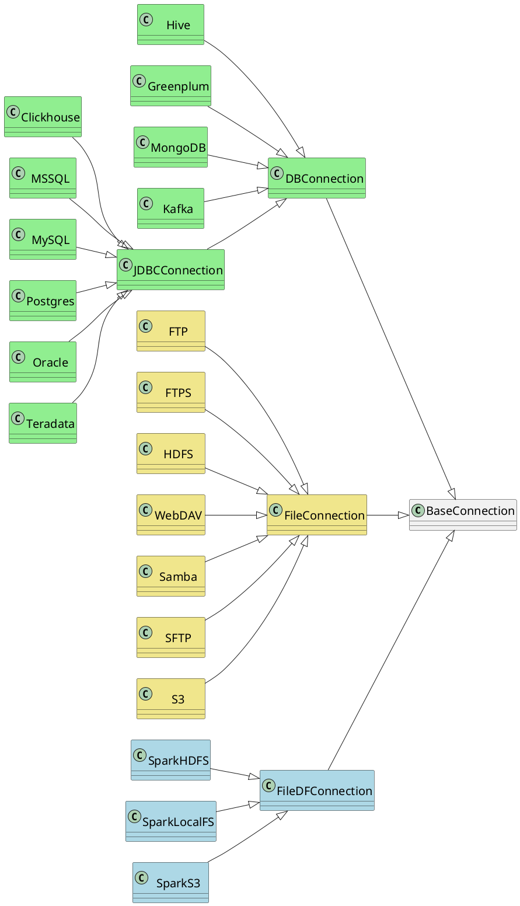
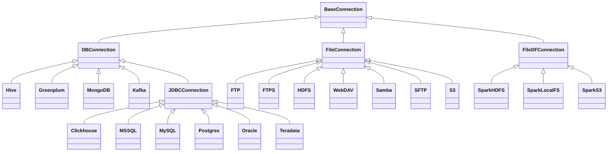

# Концепции

Здесь вы найдете подробную информацию о каждом из концептов onETL и о том, как их использовать.

## Подключение (Connection)

### Основы Connection

onETL предназначена для извлечения и загрузки данных в хранилища (БД и файловые), поэтому в ней есть концепт первого класса `Connection` для хранения учетных данных, используемых для взаимодействия с внешними системами.

`Connection` - это, по сути, набор параметров, таких как имя пользователя, пароль, имя хоста.

Чтобы создать подключение к определенному типу хранилища, необходимо использовать класс, соответствующий типу хранилища. Имя класса совпадает с именем типа хранилища (`Oracle`, `MSSQL`, `SFTP` и т. д.):

```python
from onetl.connection import SFTP

sftp = SFTP(
    host="sftp.test.com",
    user="onetl",
    password="onetl",
)
```

Все типы подключений наследуются от родительского класса `BaseConnection`.

### Диаграмма классов





### Подключения к БД (DBConnection)

Классы, унаследованные от `DBConnection`, можно использовать для доступа к базам данных.

`DBConnection` можно создать следующим образом:

```python
from onetl.connection import MSSQL

mssql = MSSQL(
    host="mssqldb.demo.com",
    user="onetl",
    password="onetl",
    database="Telecom",
    spark=spark,
)
```

где **spark** - это текущая сессия Apache Spark (SparkSession). `onETL` "под капотом" использует `Spark` и специальные Java-коннекторы для работы с базами данных.

Описание других параметров см. в документации для [доступных DBConnections][db-connections].

### Подключения к файловым хранилищам (FileConnection)

Классы, унаследованные от `FileConnection`, можно использовать для доступа к файлам, хранящимся в различных файловых системах/файловых серверах.

`FileConnection` можно создать следующим образом:

```python
from onetl.connection import SFTP

sftp = SFTP(
    host="sftp.test.com",
    user="onetl",
    password="onetl",
)
```

Описание других параметров см. в документации для [доступных FileConnections][file-connections-0].

### FileDFConnection

Классы, унаследованные от `FileDFConnection`, можно использовать для доступа к файлам в виде Spark DataFrames.

`FileDFConnection` можно создать следующим образом:

```python
from onetl.connection import SparkHDFS

spark_hdfs = SparkHDFS(
    host="namenode1.domain.com",
    cluster="mycluster",
    spark=spark,
)
```

где **spark** - это текущая SparkSession.
`onETL` использует `Spark` и специальные Java-коннекторы под капотом для работы с DataFrames.

Описание других параметров см. в документации для [доступных FileDFConnections][file-dataframe-connections].

### Проверка доступности соединения

После создания соединения вы можете проверить доступность базы данных/файловой системы с помощью метода `check()`:

```python
mssql.check()
sftp.check()
spark_hdfs.check()
```

Он вызовет исключение, если база данных/файловая система недоступна.

Этот метод возвращает само соединение, поэтому вы можете создать соединение и сразу же проверить его доступность:

```Python
mssql = MSSQL(
    host="mssqldb.demo.com",
    user="onetl",
    password="onetl",
    database="Telecom",
    spark=spark,
).check()  # <--
```

## Извлечение/Загрузка данных

### Основы

Как мы говорили выше, onETL используется для извлечения данных из удаленных систем и загрузки данных в них.

onETL предоставляет несколько классов для этого:

> * [DBReader][db-reader]
> * [DBWriter][db-writer]
> * [FileDFReader][filedf-reader-0]
> * [FileDFWriter][filedf-writer-0]
> * [FileDownloader][file-downloader-0]
> * [FileUploader][file-uploader-0]
> * [FileMover][file-mover-0]

Все эти классы имеют метод `run()`, который запускает извлечение/загрузку данных:

```python
from onetl.db import DBReader, DBWriter

reader = DBReader(
    connection=mssql,
    source="dbo.demo_table",
    columns=["column_1", "column_2"],
)

# Read data as Spark DataFrame
df = reader.run()

db_writer = DBWriter(
    connection=hive,
    target="dl_sb.demo_table",
)

# Save Spark DataFrame to Hive table
writer.run(df)
```

### Извлечение данных

Для извлечения данных используйте классы:

| | Вариант использования | Connection | `run()` получает | `run()` возвращает |
| -- | - | - | - | --- |
| [`DBReader`][db-reader] | Чтение данных из базы данных | Любое [`DBConnection`][db-connections] | - | [Spark DataFrame](https://spark.apache.org/docs/latest/api/python/reference/pyspark.sql/dataframe.html#dataframe) |
| [`FileDFReader`][filedf-reader-0] | Чтение данных из файла или набора файлов | Любое [`FileDFConnection`][file-dataframe-connections] | Нет входных данных или List[File path on FileSystem] | [Spark DataFrame](https://spark.apache.org/docs/latest/api/python/reference/pyspark.sql/dataframe.html#dataframe) |
| [`FileDownloader`][file-downloader-0] | Загрузка файлов из удаленной ФС в локальную ФС | Любое [`FileConnection`][file-connections-0] | Нет входных данных или List[File path on remote FileSystem] | [`DownloadResult`][file-downloader-result] |

### Загрузка данных

Для загрузки данных используйте классы:

| | Вариант использования | Connection | `run()` получает | `run()` возвращает |
| - | -- | - | --- | -- |
| [`DBWriter`][db-writer] | Запись данных из DataFrame в базу данных | Любое [`DBConnection`][db-connections] | [Spark DataFrame](https://spark.apache.org/docs/latest/api/python/reference/pyspark.sql/dataframe.html#dataframe) | None |
| [`FileDFWriter`][filedf-writer-0] | Запись данных из DataFrame в папку | Любое [`FileDFConnection`][file-dataframe-connections] | [Spark DataFrame](https://spark.apache.org/docs/latest/api/python/reference/pyspark.sql/dataframe.html#dataframe) | None |
| [`FileUploader`][file-uploader-0] | Загрузка файлов из локальной ФС в удаленную ФС | Любое [`FileConnection`][file-connections-0] | List[File path on local FileSystem] | [`UploadResult`][file-uploader-result] |

### Манипулирование данными

Для манипулирования данными используйте классы:

| | Вариант использования | Connection | `run()` получает | `run()` возвращает |
| - | - | -- | -- | - |
| [`FileMover`][file-mover-0] | Перемещение файлов между каталогами в удаленной ФС | Любое [`FileConnection`][file-connections-0] | List[File path on remote FileSystem] | [`MoveResult`][file-mover-result] |

### Опции

Классы извлечения и загрузки имеют параметр `options`, который имеет особое значение:

* все остальные параметры - *ЧТО* мы извлекаем / *КУДА* мы загружаем
* параметр `options` - *КАК* мы извлекаем/загружаем данные

```python
db_reader = DBReader(
    # ЧТО мы читаем:
    connection=mssql,
    source="dbo.demo_table",  # некоторая таблица из MSSQL
    columns=["column_1", "column_2"],  # но только определенный набор столбцов
    where="column_2 > 1000",  # только строки, соответствующие условию
    # КАК мы читаем:
    options=MSSQL.ReadOptions(
        numPartitions=10,  # чтение в 10 параллельных задачах
        partitionColumn="id",  # балансировка чтения данных путем назначения каждой задаче части данных с использованием выражения `hash(id) mod N`
        partitioningMode="hash",
        fetchsize=1000,  # каждая задача будет получать блок из 1000 строк при каждой попытке чтения
    ),
)

db_writer = DBWriter(
    # КУДА мы пишем - в некоторую таблицу в Hive
    connection=hive,
    target="dl_sb.demo_table",
    # КАК мы пишем - перезаписываем все данные в существующей таблице
    options=Hive.WriteOptions(if_exists="replace_entire_table"),
)

file_downloader = FileDownloader(
    # ЧТО мы загружаем - файлы из некоторого каталога в SFTP
    connection=sftp,
    source_path="/source",
    filters=[Glob("*.csv")],  # только CSV файлы
    limits=[MaxFilesCount(1000)],  # максимум 1000 файлов
    # КУДА мы загружаем - в определенный каталог в локальной ФС
    local_path="/some",
    # КАК мы загружаем:
    options=FileDownloader.Options(
        delete_source=True,  # после загрузки каждого файла удалите его из source_path
        if_exists="replace_file",  # заменить существующие файлы в local_path
    ),
)

file_uploader = FileUploader(
    # ЧТО мы загружаем - файлы из некоторого локального каталога
    local_path="/source",
    # КУДА мы загружаем - определенный удаленный каталог в HDFS
    connection=hdfs,
    target_path="/some",
    # КАК мы загружаем:
    options=FileUploader.Options(
        delete_local=True,  # после загрузки каждого файла удалите его из local_path
        if_exists="replace_file",  # заменить существующие файлы в target_path
    ),
)

file_mover = FileMover(
    # ЧТО мы перемещаем - файлы в некотором удаленном каталоге в HDFS
    source_path="/source",
    connection=hdfs,
    # КУДА мы перемещаем файлы
    target_path="/some",  # определенный удаленный каталог в том же соединении HDFS
    # КАК мы загружаем - заменить существующие файлы в target_path
    options=FileMover.Options(if_exists="replace_file"),
)

file_df_reader = FileDFReader(
    # ЧТО мы читаем - *.csv файлы из некоторого каталога в S3
    connection=s3,
    source_path="/source",
    file_format=CSV(),
    # КАК мы читаем - загружать файлы из /source/*.csv, а не из /source/nested/*.csv
    options=FileDFReader.Options(recursive=False),
)

file_df_writer = FileDFWriter(
    # КУДА мы пишем - в виде .csv файлов в некотором каталоге в S3
    connection=s3,
    target_path="/target",
    file_format=CSV(),
    # КАК мы пишем - заменить все существующие файлы в /target, если они есть
    options=FileDFWriter.Options(if_exists="replace_entire_directory"),
)
```

Более подробную информацию об `options` можно найти в документации к основным классам: [`DBConnection`][db-connections] и [`FileDownloader`][file-downloader-0] / [`FileUploader`][file-uploader-0] / [`FileMover`][file-mover-0] / [`FileDFReader`][filedf-reader-0] / [`FileDFWriter`][filedf-writer-0]

### Стратегии чтения

onETL имеет несколько встроенных стратегий для чтения данных:

1. [Стратегия моментального снимка][snapshot-strategy-0] (стратегия по умолчанию)
2. [Инкрементная стратегия][incremental-strategy-0]
3. [Пакетная стратегия моментального снимка][snapshot-batch-strategy-0]
4. [Инкрементная пакетная стратегия][incremental-batch-strategy-0]

Например, инкрементная стратегия позволяет получать только новые данные из таблицы:

```python
from onetl.strategy import IncrementalStrategy

reader = DBReader(
    connection=mssql,
    source="dbo.demo_table",
    hwm_column="id",  # обнаруживать новые данные на основе значения столбца "id"
)

# первый запуск
with IncrementalStrategy():
    df = reader.run()

sleep(3600)

# второй запуск
with IncrementalStrategy():
    # только строки, которые появились в источнике с момента предыдущего запуска
    df = reader.run()
```

или получать только файлы, которые не были загружены ранее:

```python
from onetl.strategy import IncrementalStrategy

file_downloader = FileDownloader(
    connection=sftp,
    source_path="/remote",
    local_path="/local",
    hwm_type="file_list",  # сохранить все загруженные файлы в список и исключить файлы, уже присутствующие в этом списке
)

# первый запуск
with IncrementalStrategy():
    files = file_downloader.run()

sleep(3600)

# второй запуск
with IncrementalStrategy():
    # только файлы, которые появились в источнике с момента предыдущего запуска
    files = file_downloader.run()
```

Большинство стратегий основаны на [`HWM`][hwm], пожалуйста, ознакомьтесь с документацией по каждой стратегии для получения более подробной информации.

### Почему просто не использовать класс Connection для извлечения/загрузки?

Соединения очень просты, у них есть только набор некоторых основных операций, например, `mkdir`, `remove_file`, `get_table_schema` и так далее.

Высокоуровневые операции, такие как

* Поддержка [`strategy`][strategy]
* Обработка отправки/получения метаданных
* Обработка различных опций, таких как `if_exists="replace_file"` в случае загрузки/выгрузки файлов

перенесена в отдельный класс, который вызывает методы объекта соединения для выполнения некоторой сложной логики.
